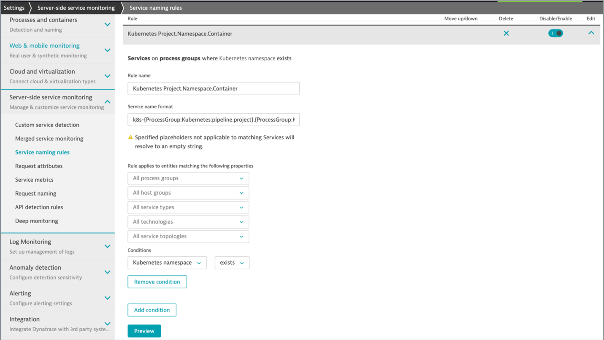
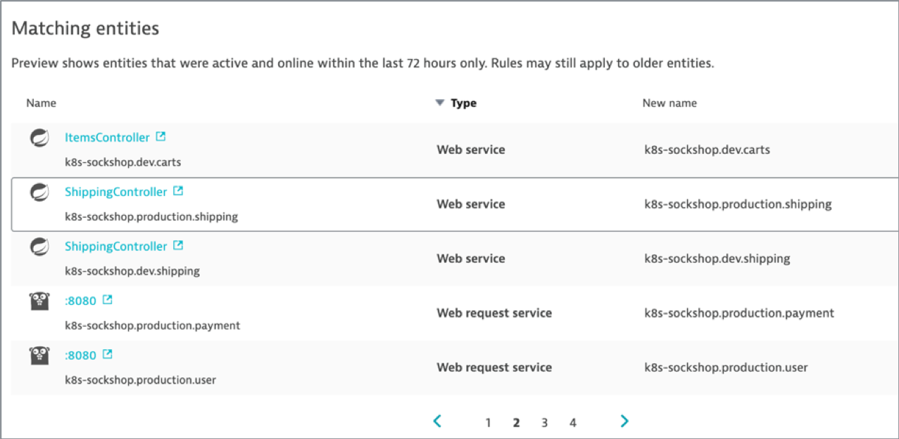
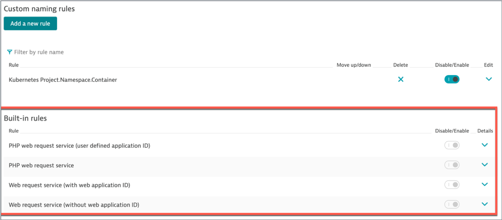
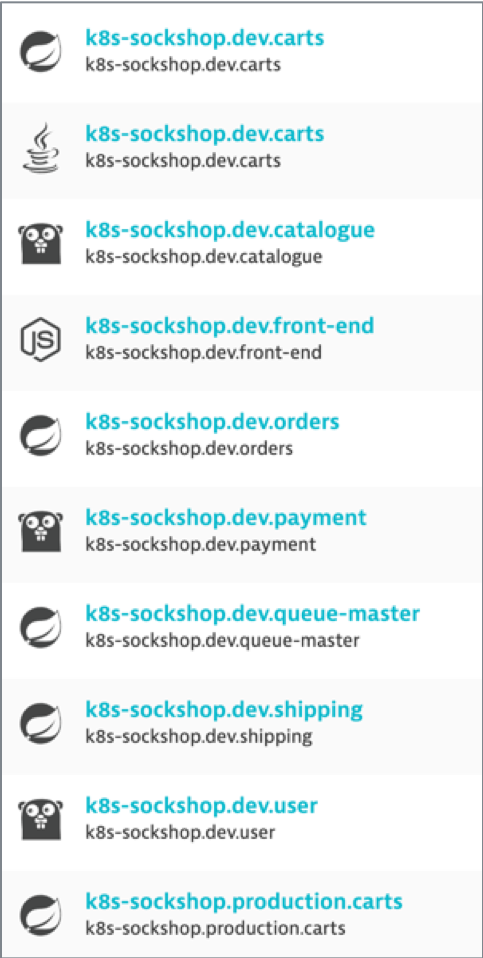

# Exercise #5 Customize Service naming rules for Kubernetes

## Explore auto-detected Service names

Take a quick look at the current Service naming as automatically assigned by Dynatrace with the built-in naming rules.

You can see <b>Services</b> in different locations in the Dynatrace console

- Service & Transactions dashboard
- Technologies/Process Groups dashboard : for a given Process Group, the infographic shows the Service implemented by the Process Group
- Smartscape

## Configure custom Service naming rule

We want to achieve with Services a similar result than we did with Processes, showing up with naming that tells us:

- Whether the Services are in Kubernetes or not. Have Service name start with ”k8s" for those in Kubernetes.
- What project is the Service part of. Your company likely has multiple projects running in the same cluster.
- The Service namespace, which in our case with Sock Shop also tells us if it's production or dev.
- The container name, which correspond to our microservice name
- In some cases, SpringBoot for example, there can be multiple web services for the same Java process. So we also want to see the Web Service name. 

Target Service naming conviention :  k8s-project-namespace-container (Web Service Name)

Let's apply that configuration in Dynatrace!

- Go in <b>Settings -> Server-side service monitoring -> Service naming rules</b> and click <b>Add a new rule</b>
- Provide a name to the rule, for example : `Kubernetes Project.Namespace.Container Web Service`
- First, we want this rule to apply only to containerized processes running in Kubernetes. This is done by defining a condition.
  - In the conditions drop-down, select the property `"Kubernetes namespace"` and the condition `"exists"`
- For the name format, we can enter free text and/or use placeholders.
  - A list of available placeholder is displayed as a side note.
  - Placeholders are in between brackets {} to distinguish from free text
  - Enter this format : 
    - k8s-{ProcessGroup:Kubernetes:pipeline.project}.{ProcessGroup:KubernetesNamespace}.{ProcessGroup:KubernetesContainerName} {Service:WebServiceName}
  - Don’t forget to save!

### Preview 

- Click the <b>Preview</b> button

### Built-in rules

You will notice there is a section named builtin rules. This is where the out-of-the-box service naming rules are defined. 

This is helpful to understand how Dynatrace come out with auto-discovered service names. 

## Validate

Navigate to <b>Technologies</b> and <b>Transactions & Services</b> views to look at the applied custom Service naming rule.

---

[Previous : #4 Customize Process Group naming rules for k8s](../04_Customize_PG_naming_rules) :arrow_backward: :arrow_forward: [Next : #6 Customize Service naming rules for k8s](../05_Customize_Services_naming_rules)

:arrow_up_small: [Back to overview](../)