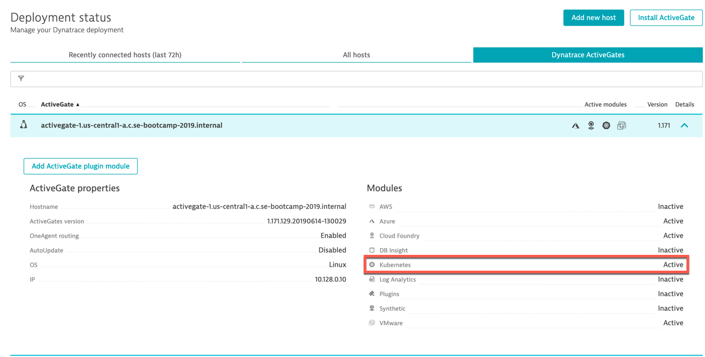
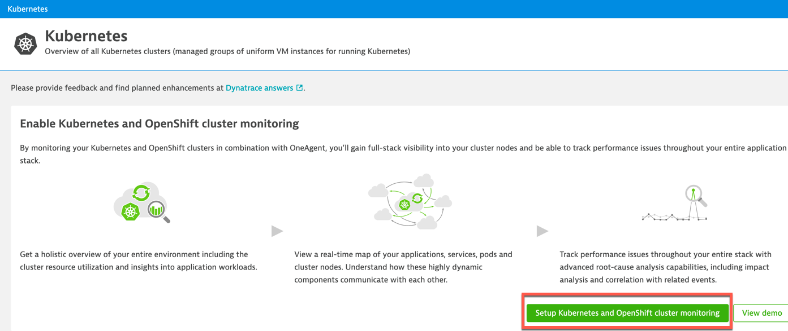

# Exercise #10 Configure Kubernetes cluster monitoring integration

## Pre-requisite : Deploy and Environment ActiveGate

- You need an Environment ActiveGate to connect Dynatrace to your Kubernetes cluster API.
- For this exercise, the Environment ActiveGate will be deployed on your bastion host

### Install the ActiveGate on your bastion host

- In the Dynatrace console, go to <b>Settings -> Deployment Dynatrace</b>, scroll down to the bottom and click on <b>Install ActiveGate</b>
  
    

- Select Linux.
- Copy the wget command (from step 2) to download the installer installer script and paste it to your terminal to run it on your bastion VM. See screen shot on next slide.
- Copy the command to run the installer script (step 4) and execute it in your terminal with elevated permissions (precede with sudo)

  

- Click on Show deployment status to validate the ActiveGate is deployed and connected to your SaaS tenant. See that the Kubernetes module is active 



## Configure connection to the Kubernetes cluster

1. You first need a Kubernetes service account with the right cluster role to access the Kubernetes API
2. Collect the information required to configure the connection
   - API endpoint URL
   - Service account Bearer token 

### Create the Dynatrace cluster monitoring service account

- The manifest (yaml file) is described in the documentation but you already have it downloaded from the github repo
- Execute the following command to create the objects associated to the account :

    ```sh
    $ kubectl apply -f manifests/dynatrace/kubernetes-monitoring-service-account.yaml 
    ```

### Collect the connection information

- Get the Kubernetes API endpoint URL

  - Execute the following command :
    ```sh
    $ kubectl config view --minify -o jsonpath='{.clusters[0].cluster.server}'; echo
    ```
  - Copy the resulting string (URL) on your cheat sheet

- Get the service account API bearer token

  - Execute the following command :
    ```sh
    $ kubectl get secret $(kubectl get sa dynatrace-monitoring -o jsonpath='{.secrets[0].name}' -n dynatrace) -o jsonpath='{.data.token}' -n dynatrace | base64 -d ; echo
    ```
  - Copy the resulting string (token) on your cheat sheet.
        - Make sure the token is correct and there are no blank space

## Set up connection

- In the Dynatrace console, select <b>Kubernetes</b> in the menu
- Click on <b>Setup Kubernetes and OpenShift cluster monitoring</b>
  
    

- Click on <b>Connect new cluster</b>
  - Provide a name of your choice to your cluster connection
  - Paste the cluster API URL from your cheat sheet 
  - Paste the bearer token from your cheat sheet 
  - Click on Connect

    

## The result

You will get an error message displayed. 

What happened?


The error message mentions a problem with the TLS handshake. 

Your cluster API endpoint is using an untrusted self-signed certificate. You have 2 options : 

1. Configure the ActiveGate to skip the certificate check
   - Introduce security risks so not recommended
   - Can be OK for POC or test environments 
   - The procedure is explained in the doc here : https://www.dynatrace.com/support/help/setup-and-configuration/dynatrace-activegate/configuration/set-up-proxy-authentication-for-activegate/#expand-138option-2-disable-certificate-validation 

2. Add the cluster self-signed certificate to the ActiveGate trusted keystore. 
   - This is what we will do next.

### Add the cluster API certificate to the ActiveGate 

### Obtain the certificate

From your bastion host terminal, execute the following script. 

- The script will prompt you for your cluster API endpoint URL and will produce a PEM file (.pem) containing the API endpoint certificate. 
  
    ```sh
    $ ./get_api_cert.sh
    ```
Verify your certificate file:

    ```sh
    $ cat dt_k8s_api.pem
    ```

### Add the certificate to the keystore

You will then import this certificate to the ActiveGate keystore using the Java keytool (installed with the ActiveGate):

```sh
$ sudo /opt/dynatrace/gateway/jre/bin/keytool -import -file dt_k8s_api.pem -alias dt_k8s_api -keystore /opt/dynatrace/gateway/jre/lib/security/cacerts
```

  - This will prompt you for a password. It is : `changeit`

### Restart the ActiveGatte

You need to restart the ActiveGate for the change to the keystore to be effective.

- Stop the ActiveGate service
  
    ```sh
    $ sudo service dynatracegateway stop
    ```

- Start the ActiveGate service
  
    ```sh
    $ sudo service dynatracegateway start
    ```

## Connect to the cluster API

Go back to your Dynatrace console and try to connect again. This time it should work... :grinning:

Once connected, go to the dashboard: <b>Menu -> Kubernetes</b>

It will take a few minutes before the dashboard gets populated with data.

Navigate in your Kubernetes cluster monitoring dashboard:

  - Look at resource <b>usage</b>, <b>requests</b>, <b>limits</b>, <b>available</b>
  


  - The dahsboard displays the list of cluster nodes
    - You can filter by node labels


Drill down to a node.

- You will see the <b>Host</b> view is now showing additional metadata and metrics:
  
  - Kubernetes cluster (link)
  - Kubernetes labels (node labels)
  - Node CPU requests and limits
  - Node Memory requests and limits

---

[Previous : #9 Set up alert notifications](../09_Set_up_alert_notifications) :arrow_backward: :arrow_forward: [Next : #10 Configure k8s cluster monitoring integration](../10_Configure_k8s_cluster_monitoring_integration)

:arrow_up_small: [Back to overview](../)