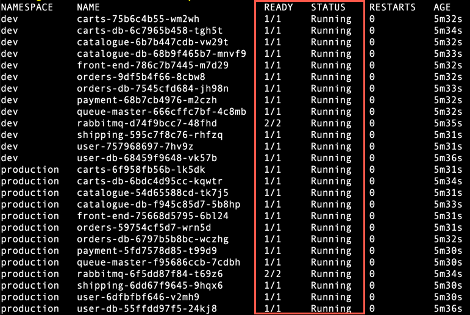
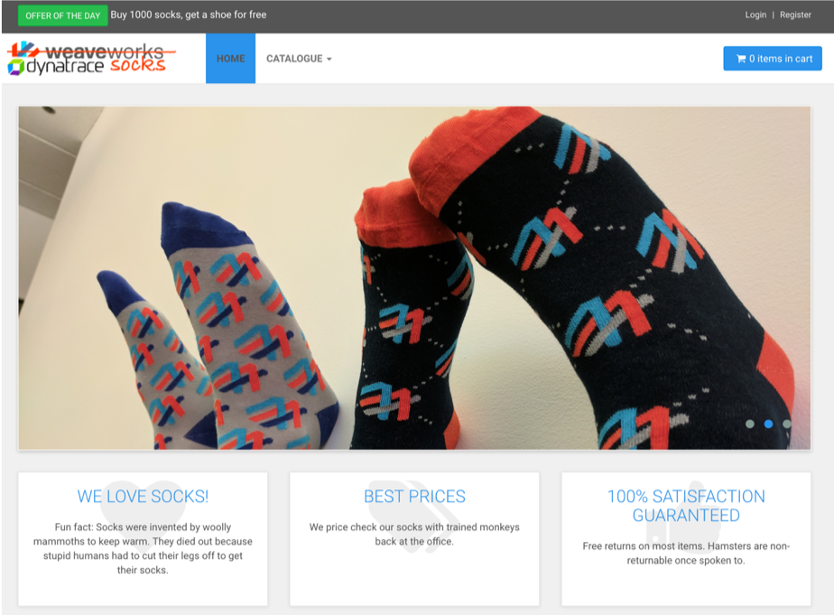

# Exercise #1 Deploy the Sock Shop app

## Script overview

First download scripts and manifests required for this class from the github repo:
```sh
$ git clone https://github.com/steve-caron-dynatrace/dynatrace-k8s.git
```
Change directory to `dynatrace-k8s`. You can take a look at the deployment script:
```sh
$ cd dynatrace-k8s
$ cat deploy-sockshop.sh
```
The script does the following tasks:
- Create a dev namespace
- Create a production namespace
- Deploy the backend services (databases and message queuing)
- Deploy the application services
- Expose frontend and carts services to public internet

## Deploy Sock Shop
Execute the deployment script:
```sh
$ ./deploy-sockshop.sh
```
## Validate
Check the pods deployed in production and in dev
```sh
$ kubectl get po --all-namespaces -l product=sockshop
```
Notice some pods status and ready state. Watch pods (run the previous command with flag -w) until all are running and ready.



## Access the Sock Shop web app

The application deployment created a Service resource of type Load Balancer to expose the frontend service to the public internet. It might take a few minutes before the public IPs becomes available.
You can obtain the app URLs by running this script:

```sh
$ ./get-sockshop-urls.sh
```
The script will wait until the IPs are available and will then print those. 


Click on the Production or Dev frontend URL to load the Sock Shop home page.

The URLs are stored in the `configs.txt` file. You can always get those by running this command (from the current directory):

```sh
$ cat configs.txt
```
## Create Sock Shop user accounts

This following script will create a few user accounts that will be used to generate traffic on the Production environment:

```sh
$ ./create-sockshop-accounts.sh
```

## Explore the app

Load the Sock Shop app page in your browser.



Run some transactions (Register, Logout, Login, Catalogue, Add to Cart, etc) .

You can manually register a new account or use one that was created during the previous step:

`username : perform`

`password : 1234`

<b><u>NOTE</u></b>: The checkout service in the application is not currently implemented. You can add items to the shopping cart but you will not be able to checkout.

---

:arrow_forward: [Next : #2 Deploy the OneAgent Operator](../02_Deploy_OneAgent_Operator)

:arrow_up_small: [Back to overview](../)
