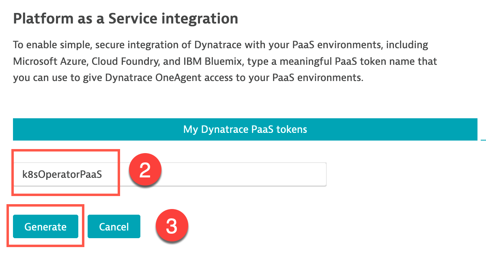
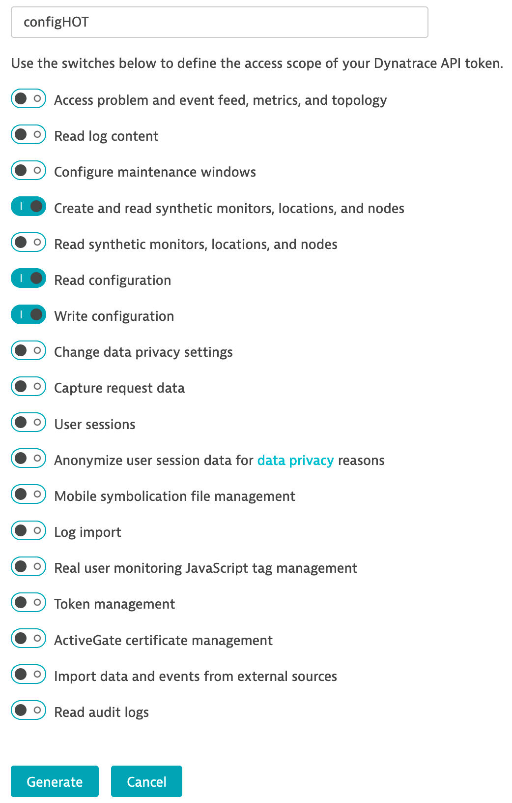

# Exercise #2 Deploy the OneAgent Operator

## Gather environment and token info

To configure and deploy the OneAgent Operator, we will need the following info from your SaaS tenant

- Environment ID
- Installation API token
- PaaS token

The installation procedure is also documented [here](https://www.dynatrace.com/support/help/shortlink/kubernetes-deploy) 

From your bastion host terminal, execute the following script to enter this info so it can be stored in a config file and you don't need to type or copy-paste those again during the class.

```
$ ./get-dt-cfg.sh
```

### Environment ID

For Dynatrace SaaS, the environment ID is your tenant ID. You can find it in the first part of your URL, e.g. `https://ENVIRONMENTID.sprint.dynatracelabs.com` .

- For example, for https://jwx05250.sprint.dynatracelabs.com , ENVIRONMENT ID=jwx05250

### API Token

Go in Settings -> Integration -> Dynatrace API

1. Click on <b>Generate Token</b>
2. Enter a name for your token (e.g. k8sOperator)
3. Copy the token value and paste it to your bastion terminal script prompt : API token 
4. Don't forget to click on the <b>Generate</b> button

 

### PaaS Token

Go in Settings -> Integration -> Platform as a Service
1. Either copy the existing InstallerDownload token or click on Generate Token
2. Enter a name for your token (e.g. k8sOperatorPaaS), click Save
3. Copy the token value and paste it to your bastion terminal script prompt : PaaS token



### Config Token

This is an additional token you will create. It is not needed for the Operator itself but it will be needed to automate some configurations in Dynatrace. This will, for example, create Web Application monitoring configuration and create Synthetic Browser Monitors to generate traffic to the Sock Shop web site.

- Follow the same procedure as for the API token except you will need to grant different access scope to this token than the default.

- Toggle on the following:

  - Create and read synthetic monitors, locations, and nodes
  - Read configuration
  - Write configuration

    


## Deploy the Operator

Execute the following commands to create the objects necessary for the Operator:

```sh
$ kubectl create namespace dynatrace
$ LATEST_RELEASE=$(curl -s https://api.github.com/repos/dynatrace/dynatrace-oneagent-operator/releases/latest | grep tag_name | cut -d '"' -f 4)
$ kubectl create -f https://raw.githubusercontent.com/Dynatrace/dynatrace-oneagent-operator/$LATEST_RELEASE/deploy/kubernetes.yaml
```

Check the logs at any time with the following command (ctrl-C to stop):
```sh
$ kubectl -n dynatrace logs -f deployment/dynatrace-oneagent-operator
```

Create the secret (named oneagent) holding the API and PaaS tokens used to authenticate to the Dynatrace cluster. Replace `<API_TOKEN>` and `<PAAS_TOKEN>` with the values copied in your cheat sheet

```sh
$ kubectl -n dynatrace create secret generic oneagent --from-literal="apiToken=API_TOKEN" --from-literal="paasToken=PAAS_TOKEN"
```

Execute the following script, it will download the Operator Custom Resource definition and populate it with the provided Environment ID. 

```sh
$ ./config-cr.sh
```

You can validate the cr.yaml file (cat cr.yaml) then create the custom resource:

```sh
$ kubectl create -f cr.yaml
```

## Validate the installation

Execute the following commands to validate the expected pods are running. You should see one pod for the operator and one pod for each of your cluster nodes (3)

```sh
$ kubectl get pods -n dynatrace -o wide -w
```

In the Dynatrace console, look into the Deployment Status and Hosts dashboards, you should see your nodes listed.

Explore the host dashboard.
- Drill down to the containers
- Drill down to the processes

Explore the Technologies dashboard

## Recycle the pods for instrumentation

The currently running pods need to be recycled so the processes running in the containers can be instrumented. The instrumentation takes place on process start up.

Execute the following script :

```sh
$ ./recycle-sockshop-app-pods-to-instrument.sh
```

Execute this command to check pod status until all are ready (ctrl-c to stop): 

```sh
$ kubectl get po --all-namespaces -l product=sockshop -w
```

## Configure Dynatrace

Execute the following script to automatically create Web Application monitoring configuration and Synthetic Browser Monitors in Dynatrace. The Synthetic tests will generate steady traffic to your Sock Shop production web app.

```
$ ./config-dt-webapps-synth.sh 
```

---

[Previous : #1 Deploy the Sock Shop app](../01_Deploy_Sock_Shop) :arrow_backward: :arrow_forward: [Next : #3 Automatic import of k8s labels and annotations](../03_Import_k8s_labels_annotations)

:arrow_up_small: [Back to overview](../)