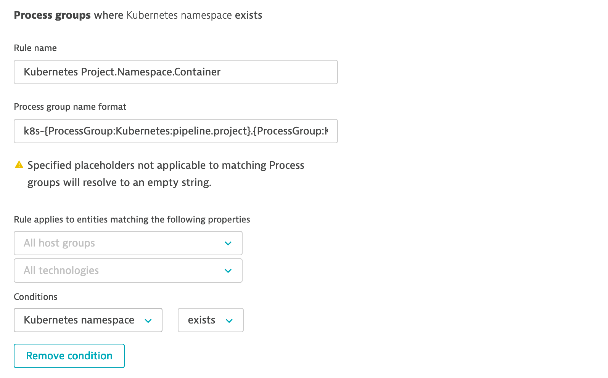
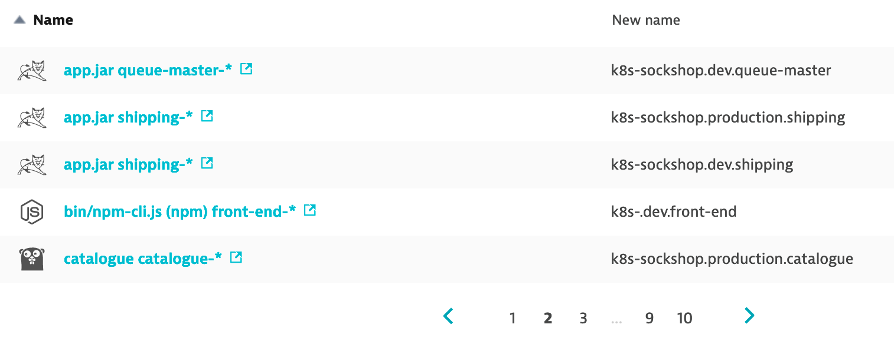
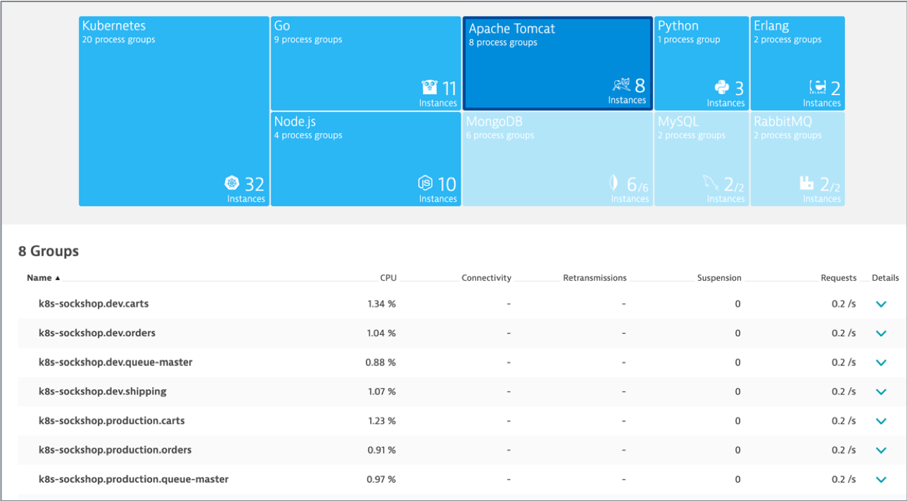

# Exercise #4 Customize Process Group naming rules for Kubernetes

## Explore auto-detected Process and Process Group names

Take a quick look at the current <b>Process</b> and <b>Process Group</b> naming as automatically assigned by Dynatrace with the built-in naming rules.

You can see processes and process groups in different locations in the Dynatrace console:

- <b>Technologies</b> view : <b>Process Groups</b> by underlying technology
- <b>Hosts</b> view : processes monitored on a <b>Host</b> (Kubernetes node)
- <b>Transactions & Services</b> view : for a given <B>Service</b>, the infographic shows the <b>Process Group Instances</b> implementing the <b>Service</b>
- <b>Smartscape</b>

## Configure custom Process Group naming rules

What we want to achieve is having process groups showing up with naming that tells us:

- Whether the process runs in Kubernetes or not. Let's have the Process Group name start with `k8s` for those in Kubernetes.
- What project is the process (container) part of. Your company likely has multiple projects running in the same cluster.
- The process/container/pod namespace, which in our case with Sock Shop also tells us if it's production or dev.
- The container name, which correspond to our microservice name

Target Process Group naming convention :  `k8s-project-namespace-container`
  
Let's apply that configuration in Dynatrace!

- Go in <i>Settings -> Processes and containers -> Process group naming rules</i> and click <b>Add a new rule</b>
- Provide a name to the rule, for example : `Kubernetes Project.Namespace.Container`
- First, we want this rule to apply only to containerized processes running in Kubernetes. This is done by defining a condition.
  - In the <b>Conditions</b> drop-down, select the property `"Kubernetes namespace"` and the condition `"exists"`
- For the name format, we can enter free text and/or use placeholders.
  - Placeholders are in between brackets {} to distinguish them from free text
  - Enter this format : 
    - `k8s-{ProcessGroup:Kubernetes:pipeline.project}.{ProcessGroup:KubernetesNamespace}.{ProcessGroup:KubernetesContainerName}`

### Preview 

Before saving a rule that will affect the way information is displayed to all Dynatrace users, you would probably like to have a glance at the potential result. 

This is possible! :grinning:

- Click the <b>Preview</b> button
  - The left column shows the current auto-detected <b>Process Group</b> names as assigned by built-in rules
  - The right column shows the new names resulting from the application of the custom rule you defined

- <u>DON'T FORGET</u> to click <b>Create rule</b> then <b>Save changes</b> (bottom right button) !!!

## Validate

Your new custom naming rule should be displayed in <b>Process group naming</b> view, otherwise you forgot to save it... :unamused:

Navigate to <b>Technologies</b>, <b>Hosts</b> and <b>Transactions & Services</b> views to look at the applied custom <b>Process group naming rule.

---

[Previous : #3 Automatic import of k8s labels and annotations](../03_Import_k8s_labels_annotations) :arrow_backward: :arrow_forward: [Next : #5 Customize Service naming rules for k8s](../05_Customize_Service_naming_rules)

:arrow_up_small: [Back to overview](../)