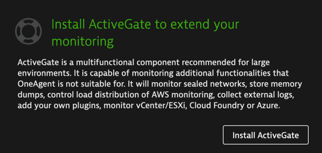
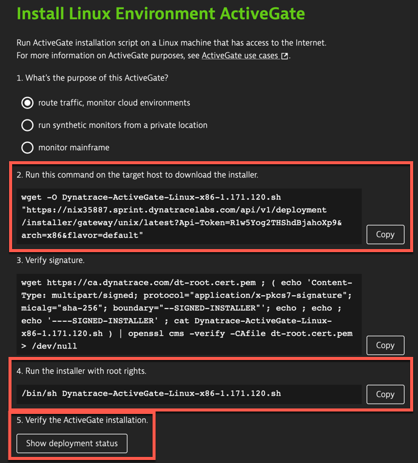
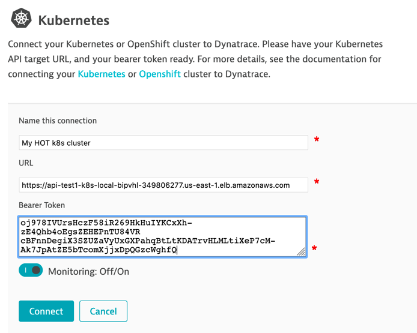
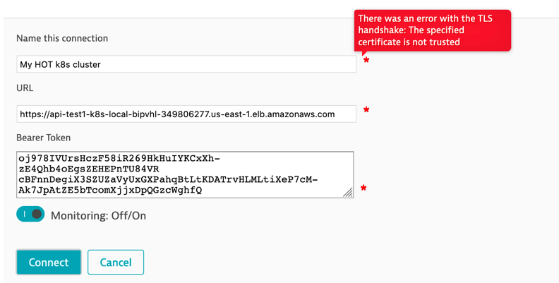
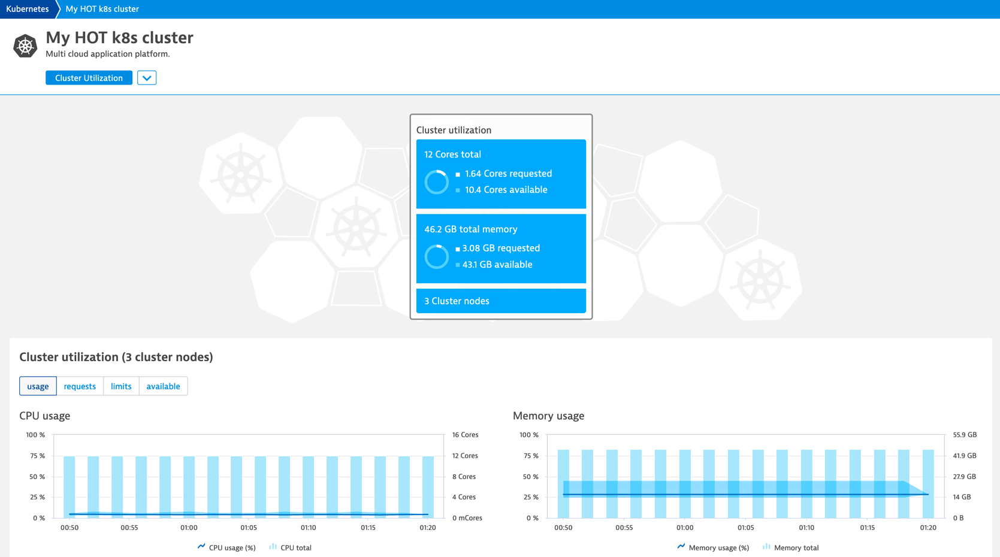
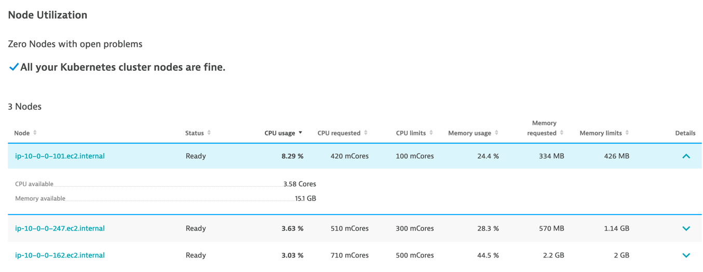
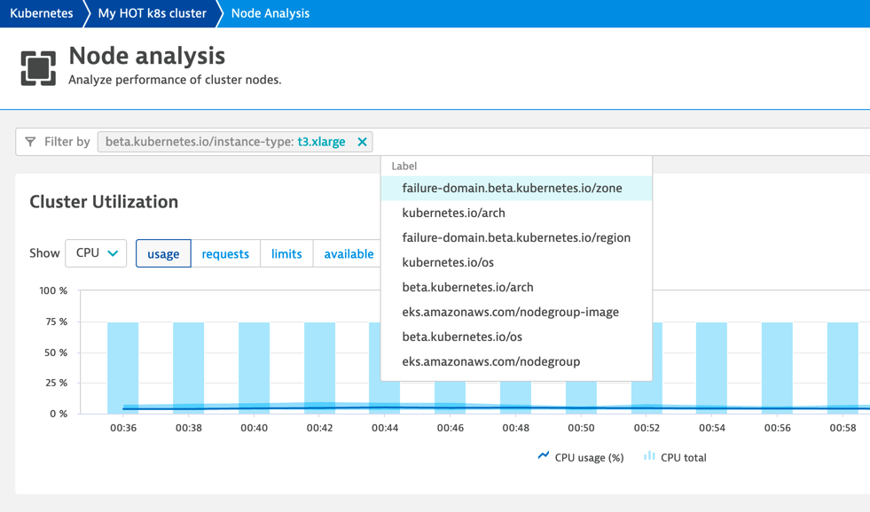
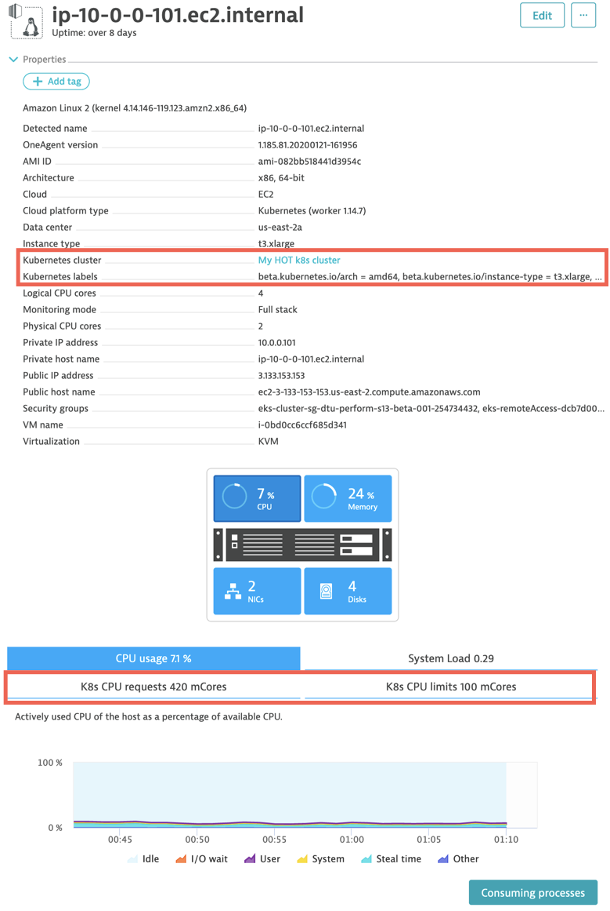
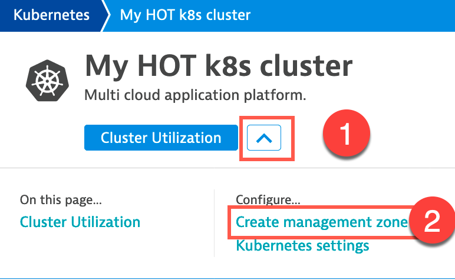

# Exercise #9 Configure Kubernetes cluster monitoring integration

## Pre-requisite : Deploy and Environment ActiveGate

- You need an <b>Environment ActiveGate</b> to connect Dynatrace to your Kubernetes cluster API
- You typically deploy the ActiveGate on a dedicated VM; running the ActiveGate in a container is not currently supported (but planned for the future)
- For this exercise, the <b>Environment ActiveGate</b> will be deployed on your bastion host

### Install the ActiveGate on your bastion host

- Make sure you are logged back in the Dynatrace console with your student account. You will need Dynatrace admin permissions for this exercise.
- In the Dynatrace console, from the menu, go to <b>Deploy Dynatrace</b>, scroll down to the bottom and click on <b>Install ActiveGate</b>
  
    

- Select Linux.
- Copy the wget command (from step 2 - see screenshot below) to download the installer script and paste it to your terminal and run it from your bastion VM.
- Copy the command to run the installer script (step 4 - see screenshot below) and execute it in your terminal with elevated permissions (precede the command with `sudo`)

  

- Click on <b>Show deployment status</b> (step 5) to validate the <b>ActiveGate</b> is deployed and connected to your SaaS tenant. See that the Kubernetes module is active. 


## Configure connection to the Kubernetes cluster

1. You first need a Kubernetes <b>service account</b> with the right <b>cluster role</b> to access the Kubernetes API
2. Collect the information required to configure the connection
   
   - API endpoint URL
   - Service account Bearer token 

### Create the Dynatrace cluster monitoring service account

- The manifest (yaml file) is described in the documentation but you already have it downloaded from the github repo
- Execute the following command to create the objects associated to the account :

    ```sh
    $ kubectl apply -f manifests/dynatrace/kubernetes-monitoring-service-account.yaml 
    ```

### Collect the connection information

- Get the Kubernetes API endpoint URL

  - Execute the following command :
    ```sh
    $ kubectl config view --minify -o jsonpath='{.clusters[0].cluster.server}'; echo
    ```

- Get the service account API bearer token

  - Execute the following command :
    ```sh
    $ kubectl get secret $(kubectl get sa dynatrace-monitoring -o jsonpath='{.secrets[0].name}' -n dynatrace) -o jsonpath='{.data.token}' -n dynatrace | base64 -d ; echo
    ```

## Set up connection

- In the Dynatrace console, select <b>Kubernetes</b> in the menu
- Click on <b>Setup Kubernetes and OpenShift cluster monitoring</b>
  
    

- Click on <b>Connect new cluster</b>
  - Provide a name of your choice to your cluster connection
  - Copy the cluster API URL you had printed during the previous step and paste it the <b>URL</b> text box
  - Copy the cluster bearer token you had printed during the previous step and paste it in the <b>Bearer Token</b> text box
    - Make sure the token is correct and there are no blank space (space, tab, line feed or carriage return).  
  - Click on <b>Connect</b>

    

## The result

You will get an error message displayed. 

What happened? :worried:



The error message mentions a problem with the TLS handshake. 

Your cluster API endpoint is using an untrusted self-signed certificate. You have 2 options : 

1. Configure the <b>ActiveGate</b> to skip the certificate check
   - Introduce security risks so not recommended
   - Can be OK for POC or test environments 
   - The procedure is explained in the doc here : https://www.dynatrace.com/support/help/setup-and-configuration/dynatrace-activegate/configuration/set-up-proxy-authentication-for-activegate/#expand-138option-2-disable-certificate-validation 

2. Add the cluster self-signed certificate to the <b>ActiveGate</b> trusted keystore. 
   - This is what we will do next.

## Add the cluster API certificate to the ActiveGate 

### Obtain the certificate

From your bastion host terminal, execute the following script. 

- The script will retrieve for your cluster API endpoint URL, use `openssl` to obtain certificate info and will produce a PEM file (.pem) containing the API endpoint certificate.   
    ```sh
    $ ./get-api-cert.sh
    ```
Verify your certificate file:

    ```sh
    $ cat dt_k8s_api.pem
    ```

### Add the certificate to the keystore

You will then import this certificate to a Java keystore (that we will name `mytrusted.jks`) using the <b>Java keytool</b> (installed with the <b>ActiveGate</b>):

```sh
$ sudo /opt/dynatrace/gateway/jre/bin/keytool -import -file dt_k8s_api.pem -alias dt_k8s_api -keystore /var/lib/dynatrace/gateway/ssl/mytrusted.jks
```

  - This will prompt you for a password. It is : `changeit`
  - It will also ask you if you want to trust this certificate. Enter : `yes`

You then need to add this keystore as the trusted keystore for the ActiveGate. To do so, you need to specify this in a custom configuration file.

This custom config file has already been prepared for you. It's content is:

```
[collector]
trustedstore = mytrusted.jks
trustedstore-password = changeit
trustedstore-type = JKS
```

- Copy the `custom.properties` file to the ActiveGate config directory:

```sh
$ sudo cp custom.properties /var/lib/dynatrace/gateway/config/custom.properties
```

### Restart the ActiveGate

You need to restart the ActiveGate for the change to the keystore to be effective.

- Stop the ActiveGate service
  
    ```sh
    $ sudo service dynatracegateway stop
    ```

- Start the ActiveGate service
  
    ```sh
    $ sudo service dynatracegateway start
    ```

## Connect to the cluster API

Go back to your Dynatrace console and try to connect again. 

<u>Note</u>: You might need enter the <b>Bearer Token</b> again. You can get it with this command:

```sh
$ kubectl get secret $(kubectl get sa dynatrace-monitoring -o jsonpath='{.secrets[0].name}' -n dynatrace) -o jsonpath='{.data.token}' -n dynatrace | base64 -d ; echo
```

This time it should work... :grinning:

Once connected, in the menu, go to <b>Kubernetes</b>

- Click on your cluster to drill-down

<u>NOTE</u>: It will take a few minutes before the dashboard gets populated with data.

Navigate in your Kubernetes cluster monitoring view:

  - Look at resource <b>usage</b>, <b>requests</b>, <b>limits</b>, <b>available</b>



  - The dashboard displays the list of cluster nodes

    

    - You can filter by node labels

        

Drill down to a node.

- You see the <b>Host</b> view is now showing additional metadata and metrics:
  
  - Kubernetes cluster (link)
  - Kubernetes labels (node labels)
  - Node CPU requests and limits
  - Node Memory requests and limits



## Create Management Zone for the k8s cluster

1. Click on the caret next <b>Cluster utilization</b> (top) to expand to configuration options
2. Click on <b>Create management zone</b>

    

3. This will bring you to the <b>Management Zone</b> definition screen, which will be pre-populated with rules associated to the cluster
4. We want to focus on infra and the platform, we will remove the Services. Click on the X to next to Services to delete that rule.
    
    

5. Click <b>Save</b>
---

[Previous : #8 Role Based Access Control with Management Zones](../08_RBAC_with_Management_Zones) :arrow_backward: :arrow_forward: [Next : #10 Set up alert notifications](../10__Set_up_alert_notifications)

:arrow_up_small: [Back to overview](../)